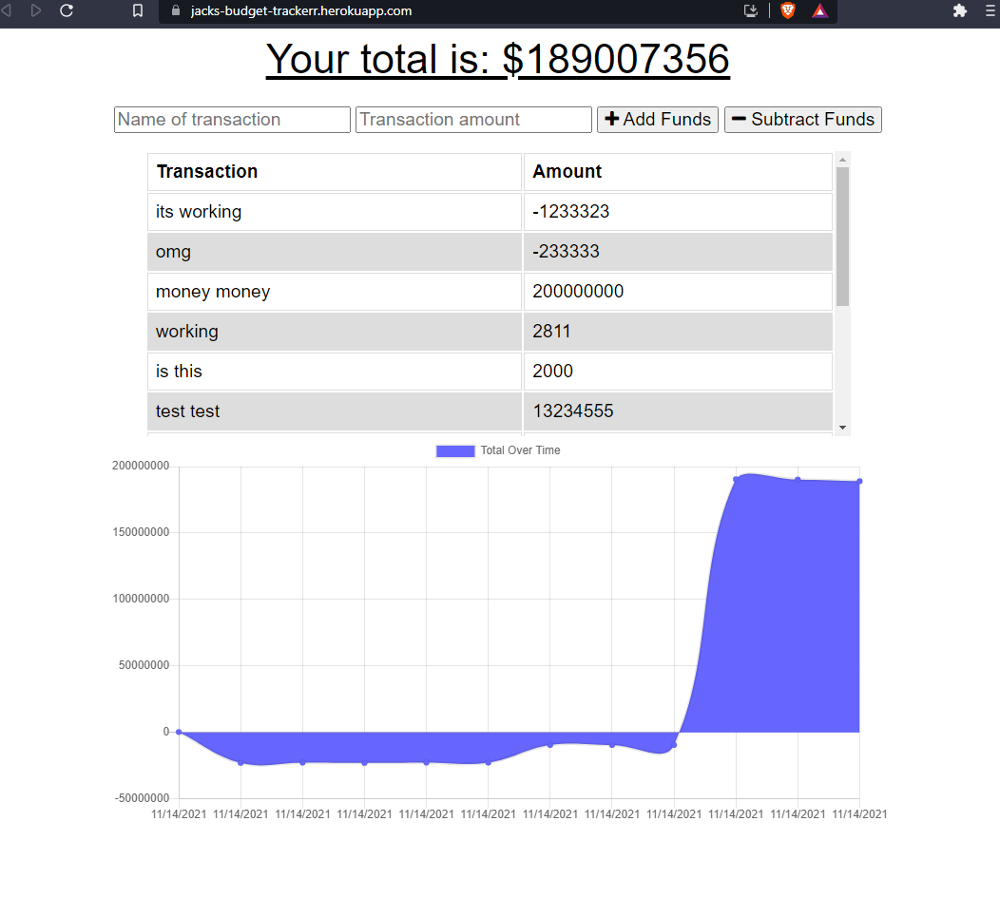

# budget-tracker

## Description
This app was created to keep track of budgeting and costs. It has both online and offline functionality. Additionally, because it functions as a PWA, it can be downloaded. 

## Table of Contents 
- [Installation](#installation)
- [Usage](#usage)
- [License](#license)
- [Contributing](#contributing)
- [Tests](#tests)
- [Questions](#questions)

## Installation
The project can be installed here: https://github.com/henlowgg/progressive-budget-tracker.git

## Usage
The project is deployed here: https://jacks-budget-trackerr.herokuapp.com/

To use it, just enter a transaction name and amount, and then choose to either add or subtract from your budget. 

## License
This project is covered by a MIT license.

## Contributing
If you want to make contributions, please refer to the following instructions:

Reach out to me via the contact information below to see how I can help.

## Tests
If you'd like to test the project, please refer to the contact info in the Questions section below.

## Questions
Please refer to the below contact information for any questions:

Github Profile - Henlowgg

Github Profile Link - https://github.com/henlowgg

Email - Henlowgg@outlook.com
